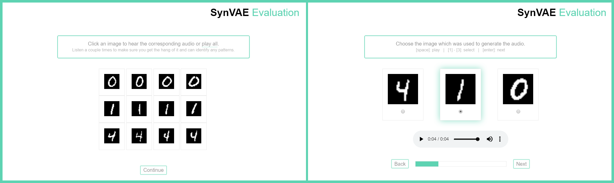

# Syneval
Web-based evaluation interface for [SynVAE](https://personads.me/x/synvae)



Evaluators are presented with an authentication screen, followed by a description of the task at hand (including optional disclaimers if necessary). They are then presented with a number of example audio-visual pairs (left screenshot) and then proceed to match up one audio with the correct image out of a number of options (right screenshot). It is possible to navigate through the tasks using keyboard shortcuts.

Option ordering is shuffled for each task to avoid a bias stemming from their presentation. Audios are loaded with generic filenames such that it is not possible to infer the correct choice by looking at the page's source. Participants are required to complete the tasks within a short timeframe since sessions expire after 10 minutes of inactivity. Additionally, an evaluator's accuracy is only presented at the very end of the evaluation, after which the session is cleared and no further changes can be made.

The tool stores the minimum amount of user-specific data as possible. It generates randomized evaluator IDs for each evaluation and stores nothing besides the data IDs of the options chosen by the evaluator. A session cookie is kept during the evaluation itself and destroyed after completion.

## Installation

This tool requires Python 3 and a number of associated packages which can be found in `requirements.txt`. The installation in a virtual environment is highly recommended.

```bash
$ pip -r requirements.txt
```

## Configuration

A configuration file placed in `app/config.json` is used as the main way to set up Syneval. It should follow the format:

```json
{
    "name": "Evaluation Name",
    "code": "X is going to take over the world",
    "disclaimer": "Optional Disclaimer",
    "data_path": "../data",
    "result_path": "../results",
    "SECRET_KEY": "Your Secret Key Goes Here",
    "classes": [
        "first class",
        "second class",
        "third class"
    ],
    "examples": [
        0,
        1,
        2
    ],
    "tasks": [
        {
            "truth": 0,
            "options": [
                3,
                4,
                5
            ]
        }
    ]
}

```

* `"name"`: Name of the evaluation task displayed at the top of the page.
* `"code"`: Authentication code for evaluators. Presented as *"When are [code] going to take over the world?"*.
* `"disclaimer"` (optional): A disclaimer which is shown before the task.
* `"data_path"`: Path to the data directory relative to `/app/`. `/data/` is recommended.
* `"result_path"`: Path to the directory where results will be stored relative to `/app/`. `/results/` is recommended.
* `"SECRET_KEY"`: Secret key for generating user sessions. Choose wisely.
* `"classes"`: List of string class names in order.
* `"examples"`: Numerical IDs of audio-visual pairs presented at the beginning of the evaluation. Make sure there is an equal number of examples for each class and that they are sorted in the correct class order (e.g. `[0, 0, 0, 1, 1, 1, 2, 2, 2]` for 3 examples for 3 classes).
* `"tasks"`: List of task objects.
  * `"truth"`: Index of the true data point within the options.
  * `"options"`: List of numerical IDs for the options being presented.

Data should be placed in a directory accessible to the app and contain image in PNG-format and audio in WAV-format with numerical IDs following the format `data/ID_orig.png`and `data/ID_audio.wav`.

Results are stored in the specified results directory in JSON format. Each file is named according to the random evaluator ID and contains a single list of IDs chosen in each task (e.g. `[3, 7, 10, 11]`).

## Running the Server

Starting SynEval can be done from the `app/` directory using the following command and should produce the following output if Flask is configured in development mode:

```bash
$ cd app/
$ python syneval.py
 * Serving Flask app "syneval" (lazy loading)
 * Environment: development
 * Debug mode: off
 * Running on http://127.0.0.1:5000/ (Press CTRL+C to quit)
```

Evaluation can now be performed by accessing the server on http://localhost:5000 with results appearing in the specified results directory.

To run Syneval in a production environment, please refer to respective WSGI guides for Apache or nginx.

## Analysing Results

A script to analyse results is included in the `scripts/` directory. It calculates evaluator accuracy, Fleiss' kappa and additional statistics.

```bash
$ python scripts/collect_results.py app/config.json results/
```

It is also to generate a plot of the results by adding the `--plot` flag and additionally specifying the data directory using `--data_path`:

```bash
$ python scripts/collect_results.py app/config.json results/ --plot --data_path data/
```